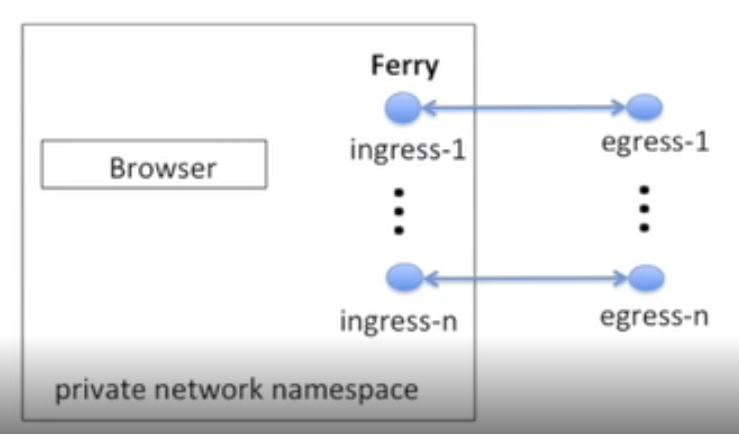
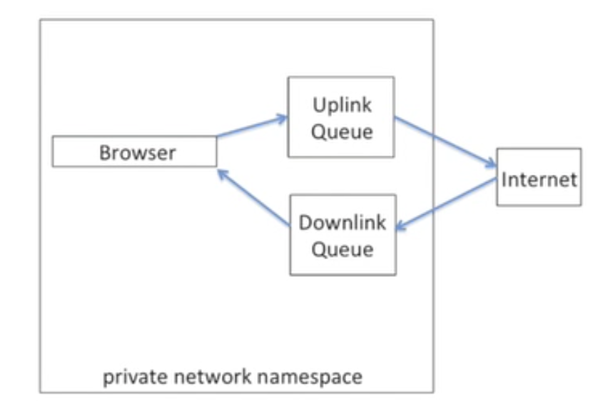
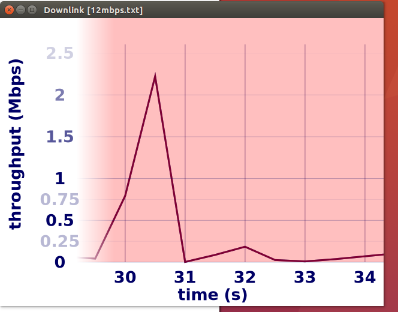
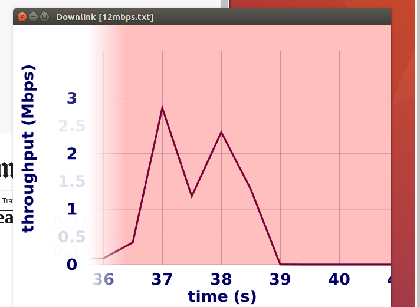

# Mahimahi Documentation
## Useful Links
* [Manual Page](https://manpages.debian.org/stretch/mahimahi/mahimahi.1)
* [Original Project Page](http://mahimahi.mit.edu/) Some of documentation here is based off of the talk linked to on the original Mahimahi project page
* [Traces](https://www.dropbox.com/sh/ss0zs1lc4cklu3u/AAB-8WC3cHD4PTtYT0E4M19Ja?dl=0)

## Purpose and goals
* The purported benefit of mahimahi is to as an accurate record and replay for http
* accuracy -> multi-server emulation
* isolation -> use of private network namespaces
* composability -> structure components as unix shells

## Tools
* all shells can be nested to do diff configs
* Record and Replay
	* RecordShell
	* ReplayShell
* Network Emulation
	* DelayShell
	* LinkShell
	* LossShell

## Workflow
* On Startup
	* private network namespace
	* several ingress and egress interfaces
		* connected via packet ferries
			* record traffic, serve recorded content, delay packets
	* spawns bash shell in the private namespace 
	* {:height="50%" width="50%"}

## ReplayShell
* replay recorded traffic locally
* no egress interfaces, no traffic actually leaves namespace
* makes ingress interface, running seperate apache servers
* benefits
 	* preserves multi-server nature of web app
 	* transparent to client application

## DelayShell/LinkShell
* emulate fixed propagation delay or fixed/variable-rate links
* {:height="50%" width="50%"}
* connect namespace to outer namespace (another mahimahitool or the internet)
* packets spawned in native namespace goes to uplink, packets from other namespace to current namespace in downlink
* DelayShell (min RTT)
** release packets after specified delay
* LinkShell (link rates)
** release based on traces
** live graphing of network usage/queuing delay

## How Goals are achieved
* Accuracy
	* ReplayshellShell correctly emulates multi-server apps
* Isolation
	* Each shell creates new network namespace
	* allows multiple instances to be run in parallel
* Composability
	* each tool structured as a Unix shell
	* unmodified apps can run in each shell
	* shells can be arbitrarily nested within one another

## Replay Example
* Code to run
* The goal here is to record nytimes page, and then emulate a replay with certain delay
* create/copy a .txt file called '12mpbs.txt', like [here](https://github.com/hongzimao/pensieve/blob/master/run_exp/12mbps)
* Commands:
```	
mm-webrecord /tmp/nytimes chromium-browser --ignore-certificate-errors --user-data-dir=/tmp/nonexistent$(date +%s%N) www.nytimes.com
mm-webreplay /tmp/nytimes   
ifconfig
mm-delay 50
ifconfig
mm-link --meter-downlink 12mbps.txt 12mbps.txt
```
* a graphing window should appear, comparing time to throughput (downlink thruput)
```ifconfig``` shows that in different shells, you are in different namespaces, hence different interfaces
* ```mm-webrecord``` records nytimes, and then replay of those files emulates the nytimes recording
* ```mm-replay``` sets up replay environment
* ```mm-delay 50``` sets up rtt 100ms
* WARNING: if you are getting ```std::runtime_error: xcb...``` errors, that means X11 is not working
* Once the ```mm-link``` command starts running, launch nytimes by
```
chromium-browser --incognito http://www.nytimes.com
``` 
* you should now see the below figures, as it attempts to load in the page with 12mbps
* {:height="50%" width="50%"}
* {:height="50%" width="50%"}
* graph interpretation
	* shaded region is link capacity
	* on a smaller mbps (3, maybe), the graphing line should split out to red and blue. Blue is throughput webervers trying to use on downlink, red is what linkshell allows them to use